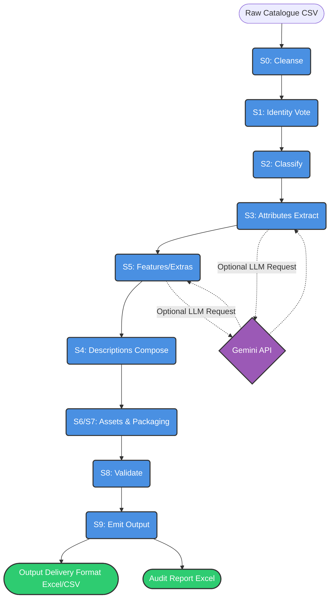
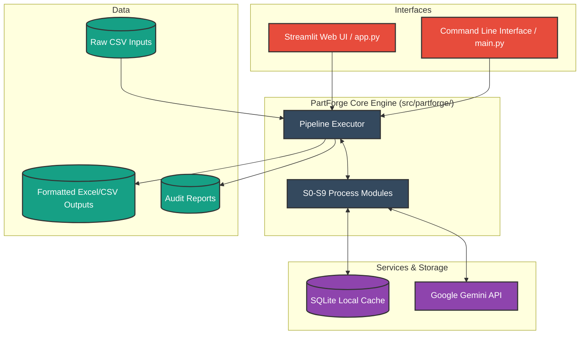

<div align="center">
  <h1>⚙️ PartForge</h1>
  <p><strong>AI Product Content Enrichment Pipeline</strong></p>

  <p>
    <a href="https://github.com/yourusername/partforge/actions"></a>
    <a href="https://github.com/yourusername/partforge/blob/main/LICENSE"></a>
    <a href="https://python.org"></a>
    <a href="https://streamlit.io"></a>
  </p>

  <p>
    <em>Raw industrial catalogue rows in → <strong>Unilog 252-column Delivery Format</strong> out.</em>
  </p>
</div>

---

## 📖 Overview

PartForge turns cryptic supplier rows like `49-94-0013 Milw 5"x.045"x7/8" Metal Cut Off Disc` into complete, standardised, search-ready product records:

*   ✨ **Canonical manufacturer/brand** (distributor ≠ manufacturer!)
*   🗂️ **Classpath taxonomy**
*   📝 **Six differently-formatted descriptions**
*   🏷️ **Attribute triplets**
*   🖼️ **Digital-asset references & packaging data**

It includes per-row confidence flags so **blank + flagged always beats invented** (hallucination control by design).

---

## 🚀 Quickstart

Get up and running with just 3 commands:

```bash
# 1. Install dependencies
pip install -r requirements.txt

# 2. Run the pipeline
python main.py --input sample_input.csv --out out/

# 3. Run rule-compliance tests
python -m pytest tests -q
```

> [!TIP]
> **Optional:** Add a Gemini key in `.env` (`GEMINI_API_KEY=...`) to enable LLM enrichment. Without a key, the pipeline runs in a fully deterministic mode.

**Demo UI:**

```bash
streamlit run app.py
```

---

## 🛠️ Built With (Technologies Used)

PartForge leverages a modern, robust tech stack for data processing and AI enrichment:

<p align="center">
  
  
  
  
  
  
</p>

*   🐍 **Python 3**: Core backend programming language.
*   🐼 **Pandas**: Used for robust data manipulation, CSV parsing, and tabular DataFrame management.
*   👑 **Streamlit**: Powers the interactive web-based graphical user interface (GUI).
*   ⚡ **RapidFuzz**: Provides rapid fuzzy string matching used in supplier/brand identity resolution.
*   🧠 **Google Gemini API**: Utilized for precise JSON-mode LLM content enrichment (temperature 0).
*   💾 **SQLite**: Local caching engine to persist LLM calls, minimizing latency and API costs.
*   🧪 **Pytest**: Used for comprehensive rule-compliance validation and test assertions.
*   📊 **OpenPyXL**: Enables reading and writing to standard `.xlsx` spreadsheet formats.

---

## 🔄 Process Flow Diagram

Below is the execution pipeline for processing each row through PartForge (S0 to S9 steps). The deterministic spine ensures reliability, with LLM used optionally at the edges.



---

## 🏗️ Architecture Diagram

The system architecture demonstrating how components and external integrations interact with the core engine:



---

## 💻 Proposed Solution UI (Wireframe)

A visual representation of the intuitive web interface provided by `app.py`:

```text
+-----------------------------------------------------------------------------------+
| ⚙️ PartForge — AI Product Content Enrichment                                      |
| Raw catalogue rows → Unilog 252-column Delivery Format. Deterministic rules...    |
+-----------------------------------------------------------------------------------+
| = Sidebar =       |  +---------------------------------------------------------+  |
| Run settings      |  | 📂 Upload input CSV                                     |  |
| [x] LLM (Gemini)  |  |    [ Drag and drop file here or Browse ]                |  |
|                   |  +---------------------------------------------------------+  |
| Parallel workers  |  | [ 🚀 Enrich ]                                           |  |
| [=======O-------] |  +---------------------------------------------------------+  |
| Row limit: [ 50]  |                                                               |
|                   |  [========================================] 100%              |
| Pipeline:         |  50/50 rows enriched                                          |
| S0 cleanse -> S1..|  rows/s: 2.5                                                  |
|                   |                                                               |
|                   |  [ ✔️ Done — 50 rows in 20s · 12 flagged NEEDS_REVIEW ]       |
|                   |                                                               |
|                   |  +-------------------------------------+ +-----------------+  |
|                   |  | Preview                             | | Downloads       |  |
|                   |  | +---------------------------------+ | | [⬇️ output.xlsx]|  |
|                   |  | | Mfg_Part | BRAND | Classpath ...| | | [⬇️ output.csv] |  |
|                   |  | | 49-94-00 | MILW  | Tools > ...  | | | [⬇️ audit.xlsx] |  |
|                   |  | | ...      | ...   | ...          | | |                 |  |
|                   |  | +---------------------------------+ | +-----------------+  |
|                   |  +-------------------------------------+                      |
+-----------------------------------------------------------------------------------+
```

---

## 📦 Outputs

The pipeline produces structured, reviewable data:

| File | Content |
|---|---|
| 📄 `out/output.xlsx` / `output.csv` | Exact 252-header Delivery Format, one row per input row |
| 📊 `out/audit_report.xlsx` | `NEEDS_REVIEW` flags, reason codes, confidence scores, and signals |
| 📈 `out/metrics.md` | PRD §5 metric table (run `python -m src.partforge.score --out out/`) |

---

## 🧠 How it works (The Spine)

Deterministic spine, LLM at the edges:

1. **`S0 cleanse`** — placeholders → `NULL`, distributor codes stripped, dedupe flagged
2. **`S1 identity vote`** — description tokens > MPN prefixes > supplier fuzzy (rapidfuzz)
3. **`S2 classify`** — keyword item-type → taxonomy classpath
4. **`S3 attributes`** — regex unit parser first; LLM fills only evidenced labels
5. **`S5 features/extras`** — series detection + one constrained LLM call per row
6. **`S4 descriptions`** — deterministic template composer (`INVOICE` ≤40 CAPS, `MOBILE` 60–80…)
7. **`S6/S7 assets & packaging`** — constructed filename/URL patterns, pack-count parsing
8. **`S8 validate`** — char limits, casing, UOM whitelist; auto-fix; flag what remains
9. **`S9 emit`** — header equality asserted against the bundled 252-column contract

*LLM calls are JSON-mode, temperature 0, SQLite-cached (`.cache/`), and parallelised (provider latency measured ~42 s/call regardless of model).*

---

## 📏 Design Rules (Abridged)

To maintain extreme quality, PartForge adheres to strict formatting standards:

*   ✔️ **Approved UOM abbreviations only** (`24 in`, `47 dBA`, never `24in`)
*   ✔️ **Decimals → trade inch fractions** (`50.25` → `50-1/4`; kerfs to 64ths)
*   ✔️ **Brand names match approved masters exactly**, ®/™ preserved
*   ✔️ **Headers are immutable**; passthrough columns copied verbatim
*   ✔️ **Every generated cell is auditable**: method + confidence + reason codes

---

## 📜 License

This project is licensed under the **MIT License**.
