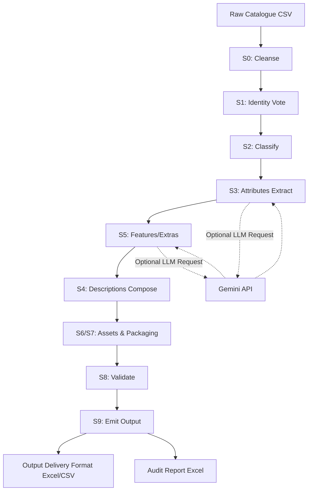
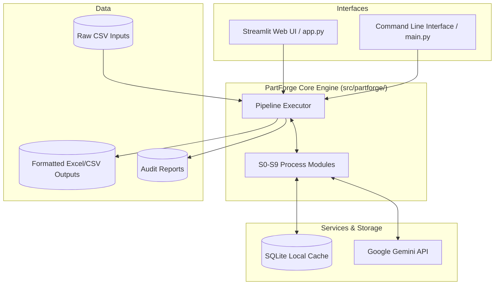

# ⚙️ PartForge — AI Product Content Enrichment Pipeline

Raw industrial catalogue rows in → **Unilog 252-column Delivery Format** out.

PartForge turns cryptic supplier rows like `49-94-0013 Milw 5"x.045"x7/8" Metal Cut Off Disc`
into complete, standardised, search-ready product records: canonical manufacturer/brand
(distributor ≠ manufacturer!), classpath, six differently-formatted descriptions, attribute
triplets, digital-asset references and packaging data — with per-row confidence flags so
**blank + flagged always beats invented** (hallucination control by design).

## Quickstart (3 commands)

```bash
pip install -r requirements.txt
python main.py --input sample_input.csv --out out/
python -m pytest tests -q          # 14 rule-compliance tests
```

Optional: put a Gemini key in `.env` (`GEMINI_API_KEY=...`) to enable LLM enrichment.
Without a key the pipeline runs fully deterministic. Demo UI:

```bash
streamlit run app.py
```

## Technologies Used

- **Python 3**: Core backend programming language.
- **Pandas**: Used for robust data manipulation, CSV parsing, and tabular DataFrame management.
- **Streamlit**: Powers the interactive web-based graphical user interface (GUI).
- **RapidFuzz**: Provides rapid fuzzy string matching used in supplier/brand identity resolution.
- **Google Gemini API**: Utilized for precise JSON-mode LLM content enrichment (temperature 0).
- **SQLite**: Local caching engine to persist LLM calls, minimizing latency and API costs.
- **Pytest**: Used for comprehensive rule-compliance validation and test assertions.
- **OpenPyXL**: Enables reading and writing to standard `.xlsx` spreadsheet formats.

## Process Flow Diagram

Below is the execution pipeline for processing each row through PartForge (S0 to S9 steps):



## Architecture Diagram

The system architecture demonstrating how components and external integrations interact with the core engine:



## Proposed Solution UI (Streamlit Mockup / Wireframe)

A visual representation of the web interface provided by `app.py`:

```text
+-----------------------------------------------------------------------------------+
| ⚙️ PartForge — AI Product Content Enrichment                                      |
| Raw catalogue rows → Unilog 252-column Delivery Format. Deterministic rules...    |
+-----------------------------------------------------------------------------------+
| = Sidebar =       |  +---------------------------------------------------------+  |
| Run settings      |  | 📂 Upload input CSV                                     |  |
| [x] LLM (Gemini)  |  |    [ Drag and drop file here or Browse ]                |  |
|                   |  +---------------------------------------------------------+  |
| Parallel workers  |  | [ 🚀 Enrich ]                                           |  |
| [=======O-------] |  +---------------------------------------------------------+  |
| Row limit: [ 50]  |                                                               |
|                   |  [========================================] 100%              |
| Pipeline:         |  50/50 rows enriched                                          |
| S0 cleanse -> S1..|  rows/s: 2.5                                                  |
|                   |                                                               |
|                   |  [ ✔️ Done — 50 rows in 20s · 12 flagged NEEDS_REVIEW ]       |
|                   |                                                               |
|                   |  +-------------------------------------+ +-----------------+  |
|                   |  | Preview                             | | Downloads       |  |
|                   |  | +---------------------------------+ | | [⬇️ output.xlsx]|  |
|                   |  | | Mfg_Part | BRAND | Classpath ...| | | [⬇️ output.csv] |  |
|                   |  | | 49-94-00 | MILW  | Tools > ...  | | | [⬇️ audit.xlsx] |  |
|                   |  | | ...      | ...   | ...          | | |                 |  |
|                   |  | +---------------------------------+ | +-----------------+  |
|                   |  +-------------------------------------+                      |
+-----------------------------------------------------------------------------------+
```

## Outputs

| File | Content |
|---|---|
| `out/output.xlsx` / `output.csv` | exact 252-header Delivery Format, one row per input row |
| `out/audit_report.xlsx` | NEEDS_REVIEW flags, reason codes, confidence, signals |
| `out/metrics.md` | PRD §5 metric table (`python -m src.partforge.score --out out/`) |

## How it works

Deterministic spine, LLM at the edges:

1. **S0 cleanse** — placeholders → NULL, distributor codes stripped, dedupe flagged
2. **S1 identity vote** — description tokens > MPN prefixes > supplier fuzzy (rapidfuzz)
3. **S2 classify** — keyword item-type → taxonomy classpath
4. **S3 attributes** — regex unit parser first; LLM fills only evidenced labels
5. **S5 features/extras** — series detection + one constrained LLM call per row
6. **S4 descriptions** — deterministic template composer (INVOICE ≤40 CAPS, MOBILE 60–80…)
7. **S6/S7 assets & packaging** — constructed filename/URL patterns, pack-count parsing
8. **S8 validate** — char limits, casing, UOM whitelist; auto-fix; flag what remains
9. **S9 emit** — header equality asserted against the bundled 252-column contract

LLM calls are JSON-mode, temperature 0, SQLite-cached (`.cache/`), and parallelised
(provider latency measured ~42 s/call regardless of model).

## Design rules (abridged)

- Approved UOM abbreviations only (`24 in`, `47 dBA`, never `24in`)
- Decimals → trade inch fractions (`50.25` → `50-1/4`; kerfs to 64ths)
- Brand names match approved masters exactly, ®/™ preserved
- Headers are immutable; passthrough columns copied verbatim
- Every generated cell is auditable: method + confidence + reason codes

## License

MIT
